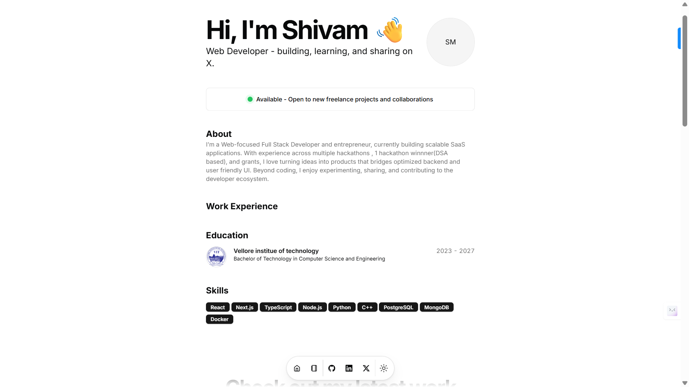

# Shivam Mishra – Developer Portfolio

<div align="center">

</div>

## Overview

This repository contains the source code for my personal developer portfolio built using modern web technologies. The portfolio showcases my projects, technical skills, and development experience.

The goal of this project is to present my work, demonstrate full-stack development ability, and provide an easy way for recruiters and collaborators to explore my projects.

Live Website:
https://www.shivam-30-mishra.vercel.app

---

## Tech Stack

The portfolio is built using a modern frontend stack focused on performance and scalability.

* **Framework:** Next.js 14
* **Language:** TypeScript
* **Frontend Library:** React
* **UI Components:** Shadcn/UI
* **Styling:** TailwindCSS
* **Animations:** Framer Motion
* **UI Utilities:** Magic UI
* **Deployment:** Vercel

---

## Features

* Responsive portfolio website
* Project showcase with GitHub and live links
* Clean modern UI built with component-based architecture
* Fast performance using Next.js optimization
* Config-driven portfolio content
* Easy customization via a single configuration file
* Blog support (optional)

---

## Project Structure

src/
components/ → Reusable UI components
data/ → Portfolio configuration data
app/ → Next.js app router pages
public/ → Static assets (images, icons)

Most personal data and portfolio content can be edited inside:

src/data/resume.tsx

---

## Running the Project Locally

Clone the repository:

```bash
git clone https://github.com/Shivam30Mishra/portfolio
```

Move into the project directory:

```bash
cd portfolio
```

Install dependencies:

```bash
pnpm install
```

Run the development server:

```bash
pnpm dev
```

Open your browser and go to:

http://localhost:3000

---

## Customization

All portfolio content such as:

* Personal information
* Skills
* Projects
* Social links
* Education

can be modified in the configuration file:

src/data/resume.tsx

---

## Deployment

The portfolio is deployed using **Vercel**.

To deploy your own version:

1. Fork the repository
2. Connect it to Vercel
3. Deploy instantly

---

## Contact

GitHub:
https://github.com/Shivam30Mishra

LinkedIn:
https://www.linkedin.com/in/shivam-mishra-777026280

Email:
[theshivammishra10@gmail.com](mailto:theshivammishra10@gmail.com)

---

## License

This project is licensed under the MIT License.
